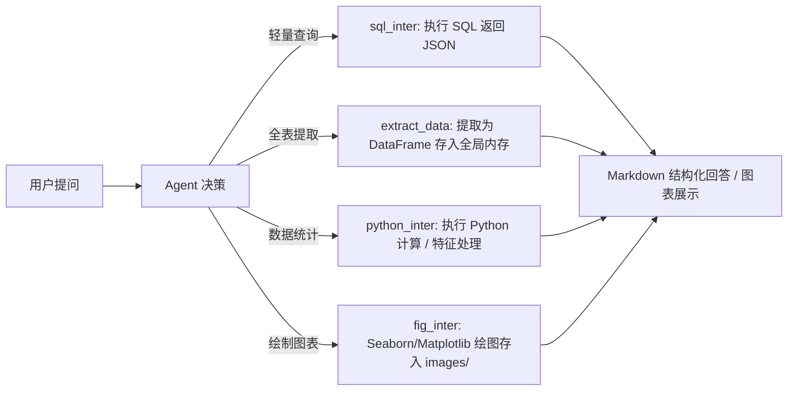

# Chapter 12: LangGraph 智能数据分析 Agent 实战 (Data Analysis Agent)

本章节基于 **LangGraph** 构建了一个闭环式的全流程**智能数据分析 Agent**，支持从数据库查询、内存数据提取缓存、Python 代码统计分析到 Seaborn/Matplotlib 数据可视化的完整分析链条。

项目同时提供了 **MySQL 版** 与 **SQLite 开箱即用版** 两种 Graph 运行模式，满足不同测试与部署场景。

---

## 目录

- [一、 项目文件结构](#一-项目文件结构)
- [二、 两种 Graph 模式对比](#二-两种-graph-模式对比)
- [三、 环境准备与快速启动](#三-环境准备与快速启动)
- [四、 四大核心分析工具说明](#四-四大核心分析工具说明)
- [五、 测试问题库（Prompt 推荐）](#五-测试问题库prompt-推荐)
- [六、 常见问题与排错（FAQ）](#六-常见问题与排错faq)

---

## 一、 项目文件结构

```text
code/chapter12/
├── langgraph.json       # LangGraph 配置文件（同时注册了两个 Agent）
├── graph.py             # MySQL 版智能数据分析 Agent
├── graph_sqlite.py      # SQLite 版智能数据分析 Agent（零配置、开箱即用）
├── init_db.py           # SQLite 模拟数据生成与初始化脚本
├── telco.db             # 自动生成的本地 SQLite 数据库文件
├── images/              # Agent 生成的可视化图表存储目录
├── requirements.txt     # 项目 Python 依赖清单
├── .env.example         # 环境变量配置模板
└── README.md            # 本说明文档
```

---

## 二、 两种 Graph 模式对比

在 `langgraph.json` 中配置了两个并行的 Agent 路由：

| 图名称 (Graph Key) | 对应入口文件 | 适用数据库 | 特性与适用场景 |
| :--- | :--- | :--- | :--- |
| **`data_agent`** | [`graph.py`](file:///d:/ZSP/Study/Python/python-agent-lab/code/chapter12/graph.py) | **MySQL** | 生产级关系型数据库连接。需在 `.env` 中配置实际的 MySQL 账号、密码与端口。 |
| **`data_agent_sqlite`** | [`graph_sqlite.py`](file:///d:/ZSP/Study/Python/python-agent-lab/code/chapter12/graph_sqlite.py) | **SQLite** (`telco.db`) | **推荐新手首选 ⭐**：Python 内置数据库，开箱即用，无需安装或启动外部 MySQL 服务。自带电信客户流失数据集。 |

---

## 三、 环境准备与快速启动

### 1. 安装依赖

确保已激活项目虚拟环境：

```powershell
cd code/chapter12
pip install -r requirements.txt
pip install "langgraph-cli[inmem]"
```

### 2. 配置环境变量（.env）

从 `.env.example` 复制创建 `.env`，并填入 API Key：

```ini
# 阿里百炼（通义千问）大模型配置
ALI_BAILIAN_BASE_URL=https://dashscope.aliyuncs.com/compatible-mode/v1
ALI_BAILIAN_API_KEY=sk-your-aliyun-api-key

# LangSmith 链路监控配置
LANGSMITH_TRACING=true
LANGSMITH_API_KEY=lsv2_pt_your_key
LANGSMITH_PROJECT=langgraph_data_analysis

# MySQL 数据库配置（如使用 data_agent 时需要）
HOST=localhost
USER=root
MYSQL_PW=your_mysql_password
DB_NAME=telco_db
PORT=3306
```

### 3. 启动 LangGraph Studio 开发服务

为避免 Windows 编码问题，推荐先设置环境变量：

```powershell
$env:PYTHONUTF8="1"
$env:PYTHONIOENCODING="utf-8"

# 启动服务
langgraph dev
```

启动后，浏览器将打开 LangGraph Studio 界面。在左上角的 **Graph 下拉列表** 中可自由切换 **`data_agent_sqlite`** 或 **`data_agent`**。

---

## 四、 四大核心分析工具说明

Agent 在分析数据时，会根据系统提示词遵循 **“取数 $\rightarrow$ 统计 $\rightarrow$ 绘图”** 的优先级链条调用以下工具：



1. **`sql_inter`**：执行 SQL 语句进行元数据查看或快速统计。
2. **`extract_data`**：将 SQL 查询结果转换为 Pandas DataFrame 缓存在 Python 运行环境的 `globals()` 中。
3. **`python_inter`**：在当前全局环境中执行 Python 代码，用于均值、中位数、相关性等统计分析。
4. **`fig_inter`**：调用 Matplotlib/Seaborn 生成可视化图表并保存为 PNG 图片，返回图片路径供 Agent 在 Markdown 中嵌入显示。

---

## 五、 测试问题库（Prompt 推荐）

你可以直接复制以下不同层级的测试问题，在 LangGraph Studio 中向 Agent 提问：

### 1. 基础探索与库表查询
- 💬 *“帮我查询数据库中一共有几张表，分别包含哪些字段？”*
- 💬 *“查询 customer_info 表中前 5 条记录，展示客户的基本信息。”*
- 💬 *“统计目前数据库中男女客户的比例分别是多少？”*

### 2. 数据提取与统计计算
- 💬 *“提取 customer_churn 表到 Python 环境中，计算客户的平均月消费（monthly_charges）和流失率（churn 为 Yes 的比例）。”*
- 💬 *“分析老年客户（senior_citizen = 1）和非老年客户在流失率上有什么区别？”*
- 💬 *“按合约类型（contract）分组，统计不同合约客户的平均在网月数（tenure）和流失人数。”*

### 3. 多表关联复杂分析
- 💬 *“关联 customer_info、customer_services 和 customer_churn 三张表，分析开通光纤网络（Fiber optic）且没有线上安全服务（online_security = 'No'）的客户流失率。”*
- 💬 *“找出月消费最高的前 10 位客户，列出他们的 ID、合约类型、支付方式以及是否流失。”*

### 4. 数据可视化与图表绘制
- 💬 *“请绘制一张条形图（Bar Plot），展示不同合约类型（Contract）下客户流失（Churn）与未流失的人数分布，并保存图片。”*
- 💬 *“绘制一张箱线图（Box Plot），对比流失客户与留存客户的月费用（Monthly Charges）分布差异，并在回答中展示图表。”*
- 💬 *“绘制在网月数（Tenure）与月费用（Monthly Charges）的散点图，用流失状态（Churn）做颜色区分。”*

### 5. 端到端综合业务洞察
- 💬 *“请对我们的电信客户流失情况做一次全方位的探索性数据分析（EDA）：包含总体流失率、核心流失特征分析，并绘制至少一张关键图表，最后给出 3 条降低流失率的业务建议。”*

---

## 六、 常见问题与排错（FAQ）

### Q1: 本地没有安装 MySQL，如何测试？
- **解决**：在 LangGraph Studio 中切换 Graph 为 **`data_agent_sqlite`**，它会自动读取自带的 `telco.db`，无需任何配置即可体验完整功能。

### Q2: 想要用 Navicat 等数据库客户端查看 SQLite 数据？
- **解决**：
  1. 打开 Navicat $\rightarrow$ 新建连接 $\rightarrow$ 选择 **SQLite**。
  2. 连接类型选择 **“现有的数据库文件”**，文件选择 `code/chapter12/telco.db`。
  3. **用户名与密码留空**，直接点击确定即可连接。

### Q3: 运行时报错 `TypeError: int() argument must be a string... not 'NoneType'`？
- **原因**：`.env` 文件中漏配了 `PORT` 环境变量导致 `int(os.getenv("PORT"))` 转换失败。
- **解决**：确保 `.env` 中添加了 `PORT=3306`，当前代码已增加默认端口容错保护。

### Q4: 生成的图表中文显示乱码或方块？
- **原因**：Matplotlib 默认英文字体不支持中文字符。
- **解决**：Agent 系统提示词已强制约束绘图标题、坐标轴使用英文（如 `Monthly Charges vs Churn`），如有特殊中文需求可在绘图代码中指定中文字体 `plt.rcParams['font.sans-serif'] = ['SimHei']`。
