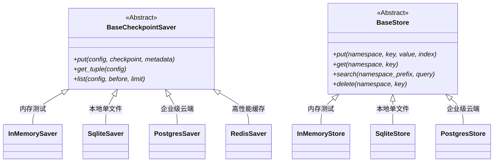
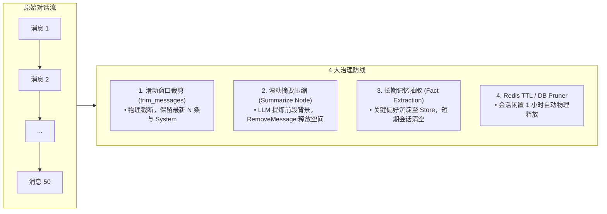

# Chapter 16 学习笔记：LangGraph 记忆管理与全能存储架构

---

## 1. AI Agent 记忆管理全景图

在 AI Agent 认知架构中，记忆是突破大模型上下文窗口（Context Window）物理限制、实现状态持久化、跨会话个性化沉淀与人机协作的核心基础设施。

```
                               ┌──────────────────────────────────────────┐
                               │           AI Agent 记忆管理体系           │
                               └────────────────────┬─────────────────────┘
                                                    │
        ┌───────────────────┬───────────────────────┴───────────────────────┬───────────────────┐
        ▼                   ▼                                               ▼                   ▼
┌───────────────┐   ┌───────────────┐                               ┌───────────────┐   ┌───────────────┐
│ 短期工作记忆  │   │ 长期事实记忆  │                               │ 情景时序记忆  │   │ 程序技能记忆  │
│(Working/State)│   │  (Semantic)   │                               │  (Episodic)   │   │ (Procedural)  │
├───────────────┤   ├───────────────┤                               ├───────────────┤   ├───────────────┤
│• 会话线程隔离 │   │• 跨会话用户画像│                              │• 时间演变流   │   │• Tool / Skill │
│• 滑动窗口裁剪 │   │• 向量检索(RAG)│                               │• 艾宾浩斯衰减 │   │• 动态 Few-Shot│
│• 滚动摘要压缩 │   │• 命名空间管理 │                               │• 事实冲突消解 │   │• 规则/SOP 沉淀│
│• 检查点快照链 │   │• Key-Value 库 │                               │• 记忆反思流   │   │• 经验沉淀库   │
└───────────────┘   └───────────────┘                               └───────────────┘   └───────────────┘
```

---

## 2. 短期记忆 vs 长期记忆：核心本质区别

> [!IMPORTANT]
> **能否跨线程（Cross-Thread / 跨会话窗口）读取，是短期记忆与长期记忆最根本的分水岭。**

```mermaid
flowchart TD
    subgraph UserInteraction [用户交互维度]
        T1["窗口 1 (thread_id: 'session_001')<br/>'我叫王林，正在学 Python'"]
        T2["窗口 2 (thread_id: 'session_002')<br/>'推荐一门进阶课程'"]
    end

    subgraph MemoryLayer [底层存储分层]
        direction TB
        subgraph ShortTerm [短期记忆 (Checkpointer - 线程强隔离)]
            S1["session_001 消息流水账快照"]
            S2["session_002 消息流水账 (新窗口为空)"]
        end

        subgraph LongTerm [长期记忆 (Store - 全局跨线程共享)]
            L1["用户全局画像 (user_id: 'user_wanglin_99')<br/>• 姓名: 王林<br/>• 职业/兴趣: 正在学 Python"]
        end
    end

    T1 -->|流水账自动写入| S1
    S1 -.->|事实提炼沉淀| L1
    T2 -->|读取当前为空| S2
    T2 ==>|跨 Thread 检索用户画像| L1
    L1 ==>|注入 System Prompt| T2
```

### 概念对比矩阵

| 维度 | 短期记忆 (Short-Term / Checkpointer) | 长期记忆 (Long-Term / Store) |
| :--- | :--- | :--- |
| **能否跨 Thread** | ❌ **严格禁止（强隔离）** | ✅ **天生支持跨 Thread 共享** |
| **索引主键 (Key)** | **`thread_id`**（会话线索 / 聊天窗口 ID） | **`user_id`** 或 `namespace`（用户或组织维度） |
| **存储内容** | **原始对话流水账**（`HumanMessage`, `AIMessage`, 节点状态） | **提炼后的结构化事实**（如姓名、外号、偏好、业务规则） |
| **生命周期** | 随会话结束而冻结，或通过 TTL 定时自动销毁 | 永久持久化，跨越多个月甚至数年 |
| **典型代表类** | `InMemorySaver`, `SqliteSaver`, `PostgresSaver`, `RedisSaver` | `InMemoryStore`, `SqliteStore`, `PostgresStore`, `Redis Hash` |

---

## 3. LangGraph 抽象基类：`BaseCheckpointSaver` 与 `BaseStore`

在 LangGraph 源码架构中，所有具体的存储实现均继承自两大标准抽象基类（接口规范）：



### 为什么需要这两个基类？（4 大企业级深度定制场景）

1. **自研 / 国产数据库适配（如 MySQL / TiDB / OceanBase / MongoDB）**：
   - 官方未内置 `MySqlSaver` 时，继承 `BaseCheckpointSaver` 实现 `put()`、`get_tuple()` 即可无缝接入。
2. **金融 / 医疗级透明加解密与合规审计**：
   - 继承 `BaseStore`，在 `put()` 前自动调用国密 SM4 / AES 加密并记录操作审计日志，读取时自动解密，上层 Agent 业务零感知。
3. **L1 + L2 多级缓存架构加速**：
   - 本地内存（L1）+ 远程 Postgres（L2），将高频读取延迟从 20ms 降至 0.1ms，减轻数据库连接压力。
4. **CI/CD 自动化测试与 Mock 桩**：
   - 编写 `MockStore` 模拟网络超时、断线重连，验证智能体的异常恢复逻辑。

---

## 4. 多后端存储方案实战对比

| 存储方案 | 短期实现 (Checkpointer) | 长期实现 (Store) | 存储介质 | 优缺点与定位 |
| :--- | :--- | :--- | :--- | :--- |
| **In-Memory** | `InMemorySaver` | `InMemoryStore` | 内存 | 极快零配置，但**进程重启数据即丢**，仅用于单元测试与快速 Demo。 |
| **SQLite** | `SqliteSaver` | `SqliteStore` | 本地 `.db` 文件 | **零服务安装、单文件持久化**，适合单机脚本、桌面工具、本地原型。 |
| **PostgreSQL** | `PostgresSaver` | `PostgresStore` | 云端/独立数据库 | **工业级标准**，支持高并发多实例共享、ACID 事务保证、结合 `pgvector` 支持向量检索。 |
| **Redis** | `Redis List` / `RedisSaver` | `Redis Hash` / `RedisVL` | 高性能内存库 | **亚毫秒级超低延迟**，原生支持 **TTL 过期销毁机制**，天然解决临时会话膨胀问题。 |

---

## 5. 短期记忆膨胀与工程治理体系

### 5.1 数据膨胀带来的影响分析

1. **数据库层面（检索性能）**：
   - **影响微弱**：因为 `checkpoints` 表对 `(thread_id, checkpoint_id)` 建立了 B-Tree 复合主键索引，单次查找时间复杂度始终保持在 $O(\log N)$（1~3ms）。
   - **潜在风险**：磁盘物理空间无节制增长（Storage Bloat）。
2. **大模型层面（LLM 上下文）—— 真正致命的瓶颈 ⚠️**：
   - **Token 费用爆炸**：每次发送请求都要全量携带历史流水账。
   - **延迟暴增 (TTFT)**：Prompt 越长，大模型首字生成耗时越高。
   - **突破窗口上限崩溃**：超过 128k/1M Token 预算直接抛错。
   - **注意力稀释 (Lost in the Middle)**：历史太长导致模型遗忘最初的关键指令。

### 5.2 生产级 4 大治理策略



#### ① 基础消息裁剪（`trim_messages`）
```python
from langchain_core.messages import trim_messages

trimmed = trim_messages(
    messages,
    max_tokens=2000,
    strategy="last",
    token_counter=llm,
    include_system=True,  # 始终保留开头的 System 指令
    start_on="human",  # 确保裁剪后首条消息为 Human
)
```

#### ② 滚动摘要压缩（`Summarize Node` + `RemoveMessage`）
1. 当未压缩消息数超过阈值（如 10 条）时，路由至摘要节点；
2. 大模型将旧对话压缩成一段精炼的 Summary；
3. 发出 `RemoveMessage(id=msg.id)` 剔除老消息；
4. 将最新 Summary 作为背景注入后续 Prompt。

---

## 6. 用户偏好演变与记忆更新策略

当用户的画像信息发生变化（例如：“今天喜欢喝拿铁”，过段时间“改为喜欢喝茶”）：

| 策略模式 | 存储结构 | 最终保存条数 | 表现与适用场景 |
| :--- | :--- | :--- | :--- |
| **原子覆写模式 (In-place Update)** | **Redis HASH (`HSET`) / Store.put** | **1 条（覆盖）** | 相同的 Key / Field，新值直接覆盖旧值。**最适合只需要当前最新有效状态的场景**。 |
| **时序事件流模式 (Append with Timestamp)** | **Redis ZSET / List** | **多条（按时间累加）** | 每条偏好打上时间戳。**适合追踪用户兴趣变迁、行为分析与历史回溯**。 |
| **智能冲突消解 (Smart Memory Resolution)** | **Mem0 / LLM 判定** | **智能合并 / 更新** | 大模型自动识别新旧矛盾，自动触发 `UPDATE / MERGE / DELETE` 指令。 |

---

## 7. 工业级落地应用场景

1. **智能电商 / 外卖专属客服**：
   - **Store (长期)**：收货地址、身材尺码、忌口（不吃香菜、海鲜过敏）。
   - **Checkpointer (短期)**：当次会话的购物车状态。
2. **个人 AI 编程与工作助理**：
   - **Store (长期)**：个人技术栈偏好（Python 类型标注、Google Docstring）、团队架构禁令。
   - **Checkpointer (短期)**：当前 Debug 任务步骤与报错上下文。
3. **人机协作审批与长流程中断（Human-in-the-Loop）⭐**：
   - 执行到“大额转账”自动中断并将状态持久化到 Postgres；
   - 领导 3 天后审批通过，Agent 从 Checkpoint 精准唤醒继续执行。
4. **时间旅行与失败重试（Time-Travel & Fork）**：
   - Agent 调研报告中途偏离预期时，利用快照链直接回滚至第 3 步重新分叉生成。
5. **医疗与慢病健康顾问**：
   - **Store (长期)**：永久保存患者过敏史（如青霉素过敏）；
   - **Checkpointer (短期)**：本次感冒问诊流水账，开药时自动触发跨会话用药禁忌拦截。

---

## 8. 高频核心面试题与答题指南

### Q1: 什么是 Checkpointer 与 Store 的本质区别？
> **答题要点**：
> 1. **作用域与隔离性**：Checkpointer 受限于单个 `thread_id`，用于维护节点执行的状态快照；Store 是全局跨 `thread_id` 的键值/向量存储。
> 2. **职责分工**：Checkpointer 负责单次工作流的断点恢复、时间旅行与人机中断；Store 负责跨会话沉淀用户画像、业务规则与长期知识。

### Q2: 为什么有了 SqliteSaver / PostgresSaver，还需要 BaseCheckpointSaver？
> **答题要点**：
> 1. **依赖倒置与解耦**：上层 Agent 仅面向抽象接口编程，切换底层数据库无需改动业务逻辑。
> 2. **企业级定制扩展**：支持接入自建数据库（如 MySQL / TiDB）、实现敏感数据透明加解密（SM4/AES）以及构建多级缓存（L1 内存 + L2 数据库）。

### Q3: 如何从架构上解决短期会话数据无休止增长带来的性能和成本问题？
> **答题要点**：
> 1. **分级治理防御**：
>    - **物理裁剪**：使用 `trim_messages` 限制最大 Token 预算；
>    - **语义压缩**：使用 `Summarization Node` + `RemoveMessage` 定期将旧消息压缩为背景摘要；
>    - **事实沉淀**：将高价值信息抽取并存入长期 `Store`，短期会话直接丢弃；
>    - **存储生命周期**：在 Redis / 数据库端开启 TTL（如 24 小时过期自动清理）。
