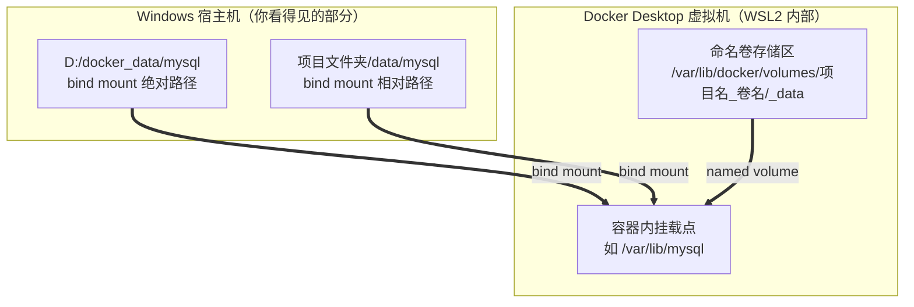

# Docker 数据挂载速查手册

> 适用环境：Windows + Docker Desktop (WSL2)。以下结论均在本机实测验证（2026-08-22）。

## 一、核心心智模型

**容器是易逝的，数据必须放在容器外。** 容器删了重建是家常便饭（`docker rm` / `docker compose up` 都会），挂载就是把容器内某个目录"接线"到容器外的持久存储上。

三种接线方式，数据落在三个不同的地方：



## 二、三种方式对比总表

| 维度 | 命名卷 | bind mount（绝对路径） | bind mount（相对路径） |
|---|---|---|---|
| docker run 写法 | `-v mysql-data:/var/lib/mysql` | `-v "D:/docker_data/mysql:/var/lib/mysql"` | `-v ./data/mysql:/var/lib/mysql` |
| compose 写法 | `mysql-data:/var/lib/mysql`（需顶层声明） | `"D:/docker_data/mysql:/var/lib/mysql"` | `./data/mysql:/var/lib/mysql` |
| 数据实际位置 | 虚拟机内 `/var/lib/docker/volumes/` 下 | 你指定的 Windows 文件夹 | docker-compose.yml 所在目录下 |
| 资源管理器能直接看 | ❌ 不能 | ✅ 能 | ✅ 能 |
| I/O 性能 | 原生 ext4，最快 | 跨 Windows→WSL2 文件共享层，较慢 | 同左 |
| 可移植性（换 Linux 服务器） | ✅ 不用改 | ❌ 盘符写死了 | ✅ 不用改 |
| `docker compose down` 后 | 数据保留（`down -v` 才删） | 保留（跟文件夹走） | 保留（跟文件夹走） |
| 典型用途 | 数据库数据、生产环境 | 多项目集中管理数据 | 开发期项目数据、源码热更新 |

## 三、分方式详解

### 3.1 命名卷（named volume）

```yaml
volumes:                    # 顶层声明，compose 自动加项目名前缀
  pgdata:                   # 实际卷名 = 项目文件夹名_pgdata

services:
  postgres:
    image: postgres:16
    volumes:
      - pgdata:/var/lib/postgresql/data
```

要点：

- 数据由 Docker 统一管理，存在虚拟机的 `/var/lib/docker/volumes/项目名_卷名/_data`，Windows 侧看不到
- **用了命名卷，项目文件夹下不会出现任何数据目录**（常见误解）
- compose 自动加项目前缀，不同项目同名卷不冲突
- 多个容器/服务可以同时挂同一个卷，共享同一份实时数据（实测：A 容器写入，B 容器立即可读）
- 容器删除不影响卷，数据持续存在

### 3.2 bind mount（绝对路径）

```yaml
services:
  mysql:
    image: mysql:8.0
    volumes:
      - "D:/docker_data/mysql:/var/lib/mysql"
```

要点：

- Windows 路径**用正斜杠 + 加引号**最稳：`"D:/docker_data/mysql"`
- 文件夹不存在时 Docker 自动创建
- Windows 侧改文件，容器内**实时生效**（实测：覆盖 index.html 后容器不重启，内容立即更新）
- 适合"多个项目共用一套数据"或"想集中管理、直接浏览备份文件"

### 3.3 bind mount（相对路径）

```yaml
services:
  mysql:
    image: mysql:8.0
    volumes:
      - ./data/mysql:/var/lib/mysql
```

要点：

- `./` 的解析基准是 **docker-compose.yml 所在目录**
- 项目在 `D:\projects\docmind\` → 数据就在 `D:\projects\docmind\data\mysql\`
- 删整个项目文件夹 = 连数据一起清理，干净利落
- 记得把 `data/` 加进 `.gitignore`（数据库二进制文件不该进版本库）
- 开发期最主流的姿势，可移植性最好

## 四、多容器共享卷（compose 写法）

```yaml
volumes:
  pgdata:        # 专用：只有 postgres 挂
  assets:        # 共享：api 和 nginx 都挂

services:
  api:
    build: .
    volumes:
      - assets:/app/public
  nginx:
    image: nginx
    volumes:
      - assets:/usr/share/nginx/html
  postgres:
    image: postgres:16
    volumes:
      - pgdata:/var/lib/postgresql/data
```

两种模式并存：`assets` 是跨服务共享（api 写、nginx 读），`pgdata` 是一服务一卷（数据隔离）。

## 五、常用命令速查

```bash
# 卷管理
docker volume ls                    # 列出所有卷
docker volume inspect 卷名           # 看存储位置等元信息
docker volume rm 卷名                # 删指定卷
docker volume prune                 # 清理所有未被使用的卷（慎用）

# 三种挂载的 docker run 形式
docker run -v mydata:/app/data ...                    # 命名卷
docker run -v "D:/docker_data/demo:/usr/share/nginx/html" ...  # 绝对路径
docker run -v "$(pwd)/data:/app/data" ...             # 相对路径（Git Bash）

# compose 数据相关
docker compose down          # 停止并删容器/网络，保留命名卷
docker compose down -v       # 连命名卷一起删！！数据库数据清零
```

## 六、坑清单（踩过的和已知的）

1. **`down -v` 连卷带删**：`down` 默认保留命名卷，`-v` 会全部清掉。数据库跑起来之后，执行 `down -v` 前先想三秒。
2. **MySQL bind mount 权限坑**：官方镜像初始化时对数据目录做 chown，跨 Windows 文件系统偶发权限报错。初始化失败先怀疑挂载方式。
3. **运行中别拷数据库目录**：容器正持有这些文件，资源管理器直接复制可能拿到不一致快照。备份要么停容器，要么用 `mysqldump` / `redis-cli BGSAVE` 这类工具。
4. **bind mount 性能**：跨 Windows→WSL2 文件共享层，数据库高 I/O 场景明显慢于命名卷。开发无所谓，压测/长期跑用命名卷。
5. **Git Bash 路径转换**：在 Git Bash 里执行 `docker exec 容器 cat /shared/file.txt`，`/shared/file.txt` 会被自动转成 Windows 路径报错。解决：包一层 `sh -c "..."`。
6. **EXPOSE ≠ 端口发布**：Dockerfile 里 `EXPOSE 80` 只是声明，真正让外部访问的是运行时 `-p 8080:80`。忘了 `-p` 的症状：容器明明在跑，就是访问不了，且无任何报错。
7. **省 C 盘的正解**：若动机是磁盘空间，用 Docker Desktop → Settings → Resources → Advanced → **Disk image location** 改到 D 盘，整个虚拟机（含全部命名卷）搬家，性能零损失。比全用 bind mount 更优。

## 七、选型决策（30 秒判断）

- 数据库长期数据、追求性能稳定 → **命名卷**
- 开发期项目数据，跟着项目走 → **相对路径 `./data`**
- 多项目共享、要直接浏览备份文件 → **绝对路径 `D:/docker_data`**
- 源码热更新（改代码容器立即生效）→ **bind mount**
- C 盘告急 → **Disk image location 搬家**（配合命名卷使用）

实战主流姿势是混搭：源码 bind mount（热更新）+ 数据库命名卷（性能稳定）+ Disk image 安家 D 盘。
